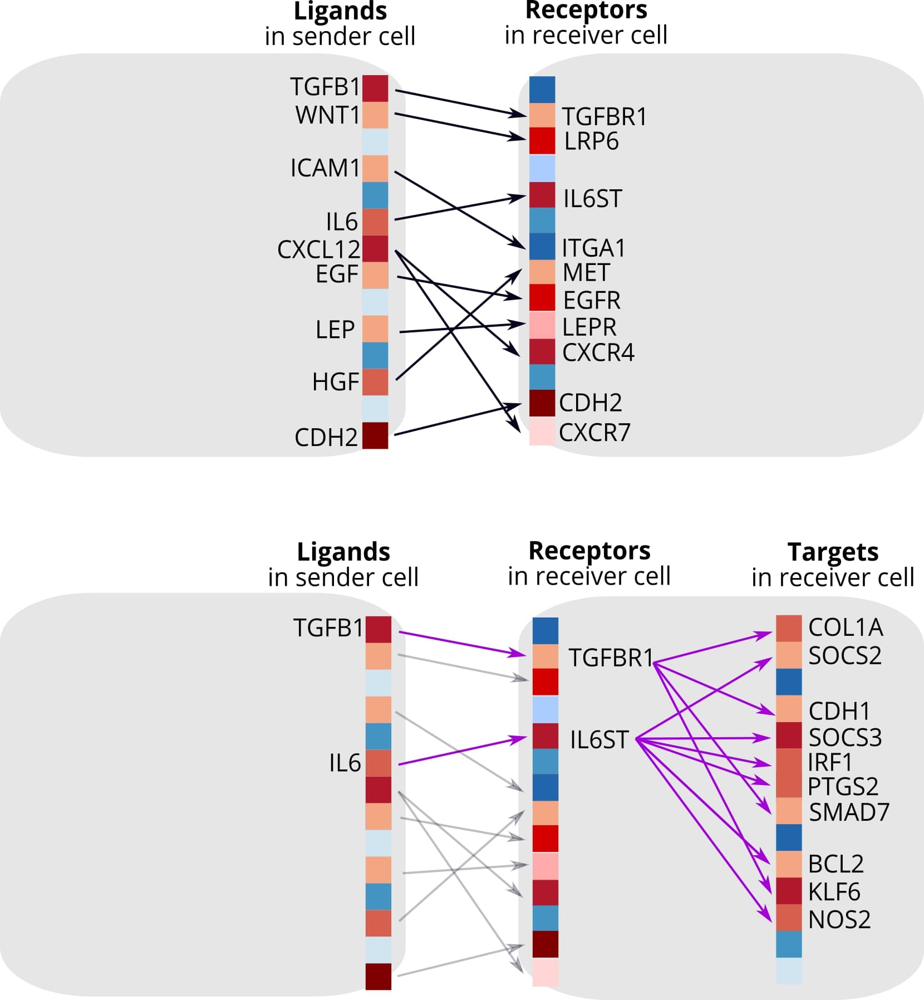
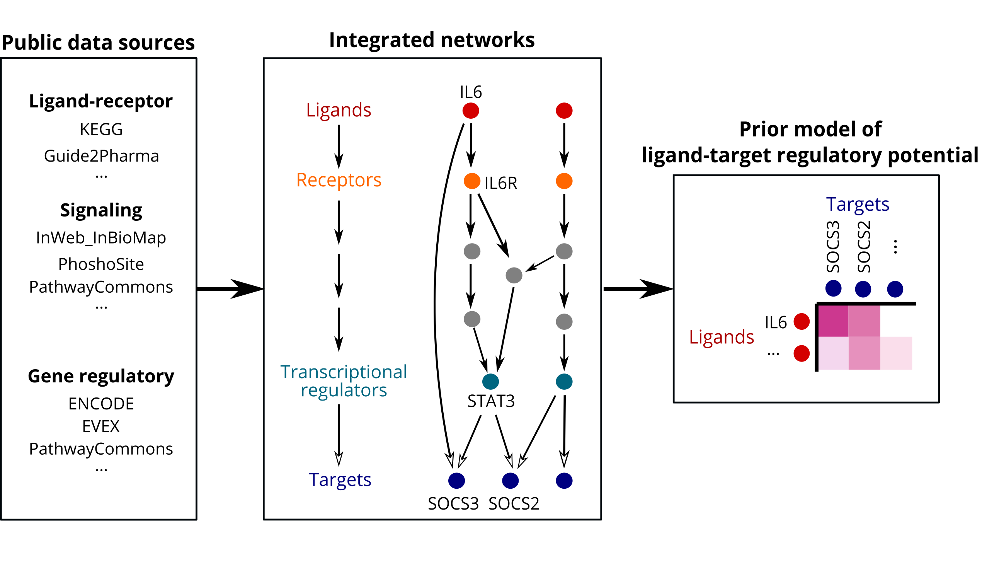
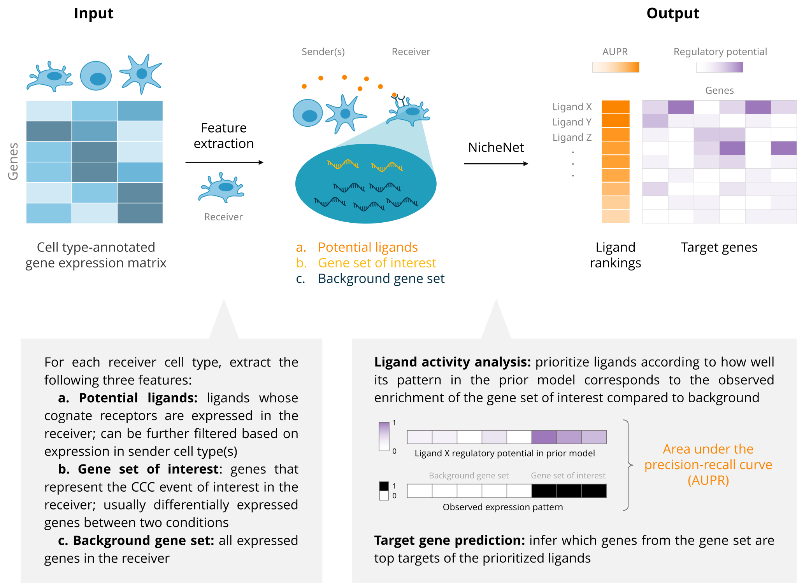

<!-- badges: start -->
[](https://github.com/saeyslab/nichenetpy/actions/workflows/python-package.yml)
<!-- badges: end -->

**nichenetpy: the python implementation of the NicheNet method. (ported from [NicheNetR](https://github.com/saeyslab/nichenetr/tree/master))** The goal of
NicheNet is to study intercellular communication from a computational
perspective. NicheNet uses human or mouse gene expression data of
interacting cells as input and combines this with a prior model that
integrates existing knowledge on ligand-to-target signaling paths. This
allows to predict ligand-receptor interactions that might drive gene
expression changes in cells of interest.

We describe the NicheNet algorithm in the following paper: [NicheNet:
modeling intercellular communication by linking ligands to target
genes](https://www.nature.com/articles/s41592-019-0667-5).

## Installation of nichenetpy

```
pip install nichenetpy
```

## Overview of NicheNet

<details>
<summary>
<h3>
Background
</h3>
</summary>

NicheNet strongly differs from most computational approaches to study
cell-cell communication (CCC), as summarized conceptually by the figure
below (**top panel:** current ligand-receptor inference approaches;
**bottom panel:** NicheNet). Many approaches to study CCC from
expression data involve linking ligands expressed by sender cells to
their corresponding receptors expressed by receiver cells. However,
functional understanding of a CCC process also requires knowing how
these inferred ligand-receptor interactions result in changes in the
expression of downstream target genes within the receiver cells.
Therefore, we developed NicheNet to consider the gene regulatory effects
of ligands. <br><br>
 <br><br>

At the core of NicheNet is a prior knowledge model, created by
integrating three types of databases—ligand-receptor interactions,
signaling pathways, and transcription factor (TF) regulation—to form a
complete communication network spanning from ligands to their downstream
target genes (see figure below). Therefore, this model goes beyond
ligand-receptor interactions and incorporates intracellular signaling
and transcriptional regulation as well. As a result, NicheNet is able to
predict which ligands influence the expression in another cell, which
target genes are affected by each ligand, and which signaling mediators
may be involved. By generating these novel types of hypotheses, NicheNet
can drive an improved functional understanding of a CCC process of
interest. We provide a pre-built prior model, it is
also possible to construct your own model (see vignettes below).


</details>
<details>
<summary>
<h3>
Main functionalities of nichenetpy
</h3>
</summary>

-   Assessing how well ligands expressed by a sender cell can predict
    changes in gene expression in the receiver cell
-   Prioritizing ligands based on their effect on gene expression
-   Inferring putative ligand-target links active in the system under
    study
-   Inferring potential signaling paths between ligands and target genes
    of interest: to generate causal hypotheses and check which data
    sources support the predictions
-   Construction of user-defined prior ligand-target models

Moreover, we provide instructions on how to make intuitive
visualizations of the main predictions (e.g., via circos plots as shown
here below).

<br><br>


</details>

As input to NicheNet, users must provide cell type-annotated expression
data that reflects a cell-cell communication (CCC) event. The input can
be single-cell or sorted bulk data from human or mouse. As output,
NicheNet returns the ranking of ligands that best explain the CCC event
of interest, as well as candidate target genes with high potential to be
regulated by these ligands. As an intermediate step, we extract the
three features required for the analysis: a list of potential ligands, a
gene set that captures the downstream effects of the CCC event of
interest, and a background set of genes. Further explanation on each
feature can be found in the introduction to nichenetpy.

 <br><br>

## Learning to use nichenetpy

The following notebooks contain the explanation on how to perform a
basic NicheNet analysis on an AnnData object. This includes prioritizing
ligands and predicting target genes of prioritized ligands. We recommend
starting with the step-by-step analysis, but we also demonstrate the use
of a single wrapper function. 

-   [Perform NicheNet analysis starting from an AnnData object:
    step-by-step
    analysis](notebooks/steps.ipynb)
-   [Perform NicheNet analysis starting from an AnnData
    object: wrapper](notebooks/wrapper.ipynb)

Case study on HNSCC tumor which demonstrates the flexibility of
NicheNet. Here, the gene set of interest was determined by the original
authors, and the expression data is a matrix rather than an AnnData
object.

-   [NicheNet’s ligand activity analysis on a gene set of
    interest](notebooks/ligand_activity_geneset.ipynb)

The following notebooks explain how to do some follow-up
analyses:

-   [Prioritization of ligands based on expression
    values](notebooks/steps_prioritization.ipynb)
-   [Inferring ligand-to-target signaling
    paths](notebooks/ligand_target_signaling_path.ipynb)
-   [Assess how well top-ranked ligands can predict a gene set of
    interest](notebooks/target_prediction_evaluation_geneset.ipynb)
-   [Single-cell NicheNet’s ligand activity
    analysis](notebooks/ligand_activity_single_cell.ipynb)

If you want to make a circos plot visualization of the NicheNet output
to show active ligand-target links between interacting cells, you can
check following notebooks:

-   [circos visualization](notebooks/circos.ipynb)

People interested in building their own models or benchmarking their own
models against NicheNet can read the following notebooks:

-   [Model construction](notebooks/model_construction.ipynb)
-   [Using LIANA ligand-receptor databases to construct the ligand-target model](notebooks/model_construction_with_liana.ipynb)
-   [Model evaluation: target gene and ligand activity prediction](notebooks/model_evaluation.ipynb)

For a comparison between Seurat's FindAllMarkers (which is ported into nichenetpy) and Scanpy's rank_genes_groups, see the following notebook:

-   [Model evaluation: target gene and ligand activity prediction](notebooks/model_evaluation.ipynb)

TODO?
## FAQ

TODO?

## References

Browaeys, R., Saelens, W. & Saeys, Y. NicheNet: modeling intercellular
communication by linking ligands to target genes. Nat Methods (2019)
<doi:10.1038/s41592-019-0667-5>

Bonnardel et al. Stellate Cells, Hepatocytes, and Endothelial Cells
Imprint the Kupffer Cell Identity on Monocytes Colonizing the Liver
Macrophage Niche. Immunity (2019) <doi:10.1016/j.immuni.2019.08.017>

Guilliams et al. Spatial proteogenomics reveals distinct and
evolutionarily conserved hepatic macrophage niches. Cell (2022)
<doi:10.1016/j.cell.2021.12.018>

